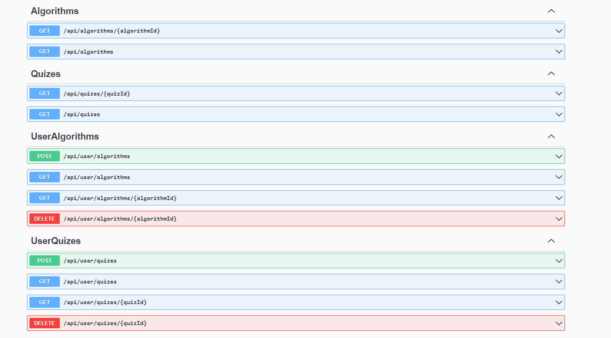
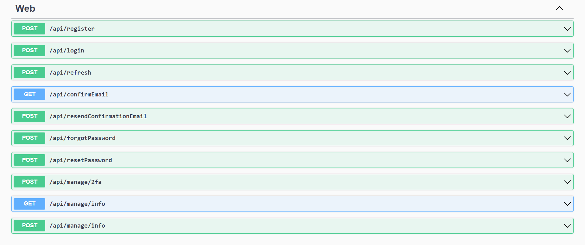

## Project description
The project is an application that allows learning programming through quizzes and algorithms generated by artificial intelligence.
The app contains a database of ready-made quizzes and algorithms. Upon registration, users can create quizzes and algorithms on any topic.
Just provide the Technology/Topic, Title, and difficulty level. OpenAI will take care of the rest!

## Endpoints
- 
- 

Endpoints with title Web - are generated by identity package !

## Architecture 
The application follows the principles of clean architecture and utilizes the Mediator and CQRS (Command Query Responsibility Segregation) patterns.
Some buissnes rules are defined in Domain Layer with help of ValueObjects (DDD). Application uses EntityFrameworkCore as ORM.
Authentication and authorization is fully handled by ASP.NET CORE Identity package which provides ready to use endpoints (login , register , refresh) etc..

## List of used technologies/libriaries/frameworks
- Application backend: ASP.NET Core, SqlServer, Entity Framework Core, Identity Api, MediatR, AutoMapper, FluentValidation
- Application frontend: Blazor WASM, AspNetCore.Components.Authorization, IntersectionObserver package, Local storage package, 
- Testing: xUnit, Moq, FluentAssertions, WebAplicationFactory - (Integration tests)
- Infrastructure : Docker , Docker Compose